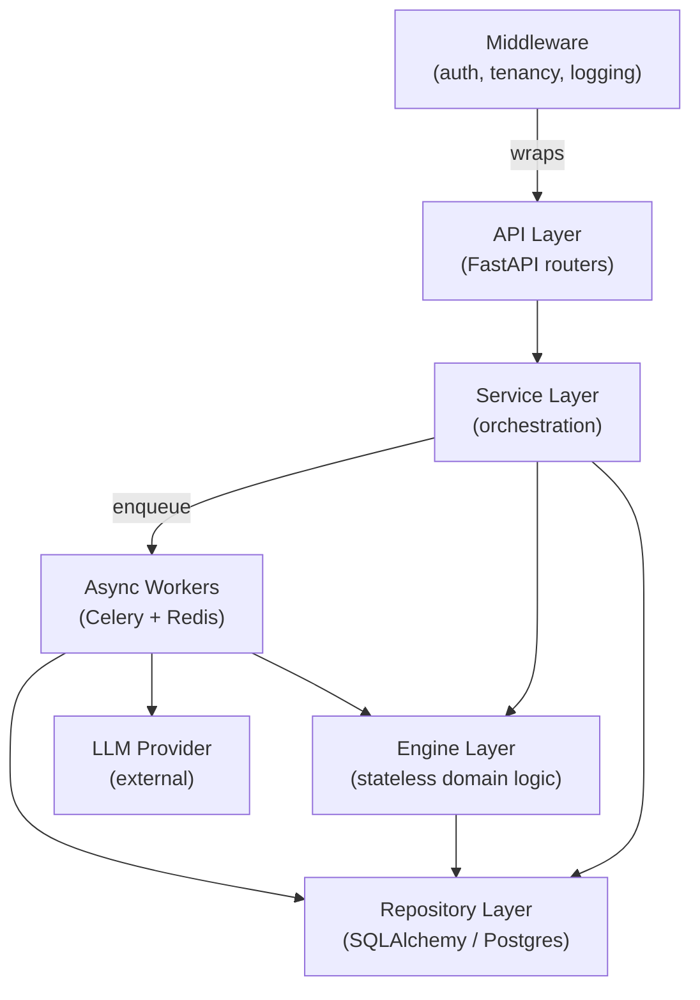
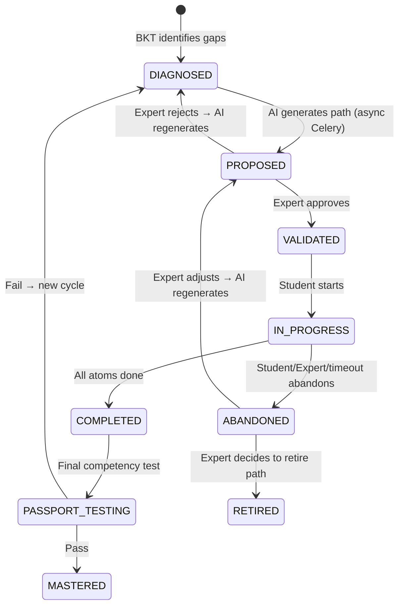
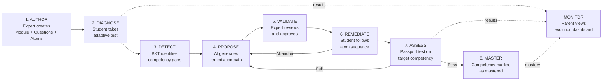
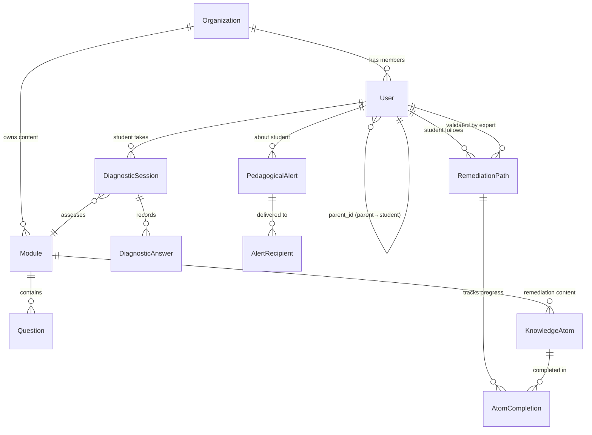
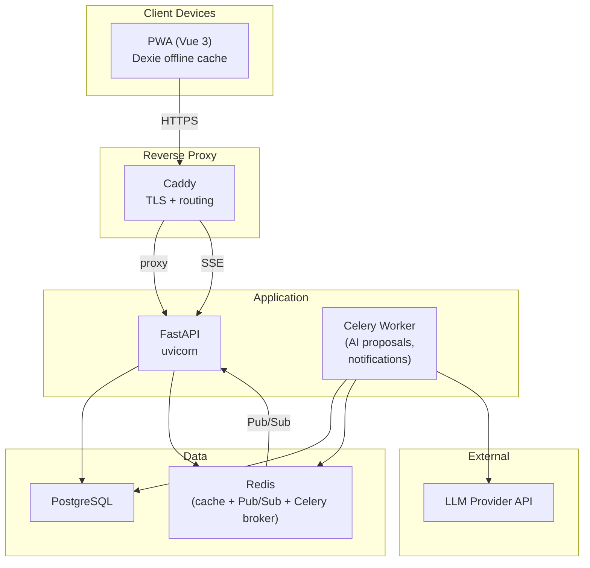

# Architecture Spine — Ihsane Platform

## Design Paradigm

**Layered + Domain-Driven**, four layers with strict dependency direction:

```
API (FastAPI routers)
  ↓ calls
Service (orchestration, auth checks, tenant filtering)
  ↓ calls
Engine (stateless domain logic: BKT, difficulty adjustment, AI proposal)
  ↓ calls
Repository (SQLAlchemy models, DB access)
```

- Each layer may only call the layer directly below it.
- Engines never call Services or the API layer.
- Engines never hold state — they receive data, compute, return results.
- The Repository layer is the sole interface to Postgres.
- Cross-cutting concerns (auth, tenancy, logging) live in middleware, not in engines.



Frontend mirrors this with a strict boundary:

```
Views (Vue 3 SFC)
  ↓ reads/dispatches
Stores (Pinia, one per domain)
  ↓ calls
Services (Axios, sole HTTP boundary)
  ↓ HTTP
Backend API
```

## Invariants & Rules

### AD-1 — Database Is the Single Source of Truth for All Domain State

- **Binds:** all
- **Prevents:** In-memory state divergence (engines holding `self._paths` dicts that evaporate on restart, disagree with DB, fail at multi-instance scale)
- **Rule:** No engine or service may hold domain state in memory between calls. Engines are pure functions: receive current state as input, return computed result as output. The service layer reads from and writes to the database via the repository. The only caches allowed are read-through caches (Redis) with explicit TTL and invalidation.

### AD-2 — Remediation Path Lifecycle Is an Explicit State Machine

- **Binds:** remediation-lifecycle, expert-validation
- **Prevents:** Implicit state transitions, paths skipping validation, inconsistent status tracking across frontend and backend
- **Rule:** Every `RemediationPath` follows this state machine. Transitions are enforced in the service layer — no direct status updates from the API layer.



Abandonment triggers: notification to Expert AND Parent. Expert can adjust or retire. Parent is informed to assist the student.

### AD-3 — Hybrid AI: Deterministic Selection + LLM Generation + Expert Validation

- **Binds:** remediation-lifecycle, content-authoring
- **Prevents:** Pure black-box LLM proposals that are untestable, or pure rule-based selection that lacks pedagogical nuance
- **Rule:** Remediation proposal generation follows three stages:
  1. **Deterministic selection** — BKT identifies weak competencies; system selects existing `KnowledgeAtom` records tagged for those competencies, ordered by difficulty. This is the testable baseline.
  2. **LLM augmentation** — An async Celery task sends the gap profile + selected atoms to an LLM. The LLM may reorder, annotate with pedagogical justification, suggest additional focus areas, or generate supplementary content. Response is stored, never streamed directly to user.
  3. **Expert validation** — The proposal (with AI justification) enters `PROPOSED` state. The Expert reviews, approves, or rejects (triggering regeneration with feedback context).

  The LLM is never in the synchronous request path. All LLM calls go through Celery. If the LLM is unavailable, the deterministic selection alone produces a valid (if less nuanced) proposal.

### AD-4 — Multi-Tenant Isolation via Organization Entity

- **Binds:** all
- **Prevents:** Data leakage between organizations, query omissions, cross-tenant content pollution
- **Rule:**
  - An `Organization` entity is the tenant boundary. Every `User`, `Module`, `Question`, `KnowledgeAtom`, `DiagnosticSession`, `RemediationPath`, and `PedagogicalAlert` belongs to exactly one Organization.
  - Every model that holds tenant-scoped data carries an `organization_id` foreign key (non-nullable).
  - Tenant filtering is enforced at the **middleware layer** (extracted from JWT claims), injected into the repository layer as a mandatory query filter. Individual services/engines never apply tenant filtering themselves — it is automatic and inescapable.
  - Shared/global content (e.g., platform-wide atom templates) is owned by a reserved system organization and explicitly marked `is_shared = True`. Tenants can read shared content but never write to it.

### AD-5 — Push Notifications via Server-Sent Events (SSE)

- **Binds:** parent-monitoring, expert-validation, remediation-lifecycle
- **Prevents:** Stale dashboards, missed pedagogical alerts, delayed Expert action on proposals
- **Rule:**
  - Real-time notifications use SSE (Server-Sent Events) over `/api/v1/events/stream`.
  - SSE is chosen over WebSocket because the notification flow is **one-directional** (server → client). SSE is simpler, works through HTTP/2 and reverse proxies (Caddy) without upgrade negotiation, and auto-reconnects natively.
  - Events that trigger SSE push: proposal ready for validation, path abandoned, Passport result, pedagogical alerts (frustration, inactivity, repeated failure).
  - The backend publishes events to a Redis Pub/Sub channel per tenant. The SSE endpoint subscribes to the tenant's channel.
  - If SSE connection drops, the client falls back to polling on reconnect until the SSE stream re-establishes. Missed events are recoverable via a `GET /api/v1/alerts?since={timestamp}` endpoint.

### AD-6 — Offline-First for Students, Online-First for Experts and Parents

- **Binds:** diagnostic-assessment, remediation-lifecycle, parent-monitoring
- **Prevents:** Lost student work on connectivity loss, unnecessary offline complexity for roles that don't need it
- **Rule:**
  - **Student role**: Dexie (IndexedDB) acts as a **write-behind buffer**. Diagnostic questions and remediation atoms are pre-fetched when online. Answers and atom completions are written to Dexie immediately, then synced to the backend when connectivity returns. Sessions pause/resume transparently.
  - **Expert role**: Online-first. Content authoring, proposal validation, and alert review require live backend access. No offline queue for mutations.
  - **Parent role**: Online-first with **read cache**. Dashboard data is cached in Dexie for offline viewing of last-fetched state, but no offline mutations.
  - The Pinia stores own the in-flight state. The service layer handles sync (queue in Dexie → flush to API on reconnect). Conflict resolution: **last-write-wins** for atom completions (idempotent); **server-wins** for path state transitions (state machine is authoritative).

### AD-7 — The Core Domain Loop Is the Organizing Principle

- **Binds:** all
- **Prevents:** Feature sprawl, UX surfaces disconnected from domain logic, ad-hoc API endpoints that don't map to the loop
- **Rule:** Every feature, API endpoint, view, and store must map to a stage in the core domain loop:



Any proposed feature that doesn't attach to one of these stages must justify its existence. The UX navigation structure mirrors these stages per role.

## Consistency Conventions

| Concern | Convention |
| --- | --- |
| **Naming — entities** | Singular PascalCase for models (`RemediationPath`, `KnowledgeAtom`). Table names: plural snake_case (`remediation_paths`, `knowledge_atoms`). |
| **Naming — files** | Backend: snake_case (`remediation_engine.py`). Frontend: PascalCase for components (`DiagnosticSession.vue`), camelCase for services/stores (`remediationService.ts`). |
| **Naming — API endpoints** | `/api/v1/{resource}` — plural nouns, snake_case. Actions as sub-resources: `/api/v1/remediation-paths/{id}/validate`, not `/api/v1/validateRemediationPath`. |
| **Data — wire format** | JSON over HTTP. Backend emits and accepts `snake_case` keys. Frontend transforms at the Axios service boundary to `camelCase` — no snake_case leaks into Vue components or stores. |
| **Data — IDs** | UUID v4 for all primary keys. |
| **Data — dates** | ISO 8601 with timezone (`2026-07-14T10:30:00Z`). Stored as `TIMESTAMP WITH TIME ZONE` in Postgres. |
| **Data — error shape** | `{ "detail": "human message", "code": "MACHINE_CODE", "field": "optional_field" }`. HTTP status codes follow REST conventions (400 validation, 401 unauth, 403 forbidden, 404 not found, 409 conflict for invalid state transitions). |
| **Data — envelopes** | List endpoints return `{ "items": [...], "total": int, "page": int, "page_size": int }`. Single-resource endpoints return the resource directly (no wrapper). |
| **State — mutation** | All domain state mutations go through the service layer. Pinia stores are the frontend's single source of truth. Direct API calls from components are forbidden — always go through the store. |
| **State — auth** | JWT tokens (access + refresh). Three roles: `student`, `expert`, `parent`. Students may also use PIN-based auth (simplified login). Role is embedded in JWT claims alongside `organization_id`. |
| **State — tenant context** | `organization_id` is extracted from JWT in middleware and injected into every repository query automatically. No service or engine ever receives or filters by `organization_id` directly. |
| **Logging** | Structured JSON logs. Every log entry includes `organization_id`, `user_id`, `request_id`. No PII in logs (no student names, no answers). |
| **i18n** | Vue-i18n with Arabic (ar) and French (fr) locales. All user-facing strings go through `$t()`. RTL layout handled by Tailwind `rtl:` variants. Backend error messages are machine codes — the frontend maps them to localized strings. |

## Stack

| Name | Version |
| --- | --- |
| Python | >= 3.11 |
| FastAPI | >= 0.115.0 |
| Pydantic | >= 2.9.0 |
| SQLAlchemy | >= 2.0.36 |
| Alembic | >= 1.14.0 |
| asyncpg | >= 0.30.0 |
| Redis | >= 5.2.0 |
| Celery | >= 5.4.0 |
| Vue | ^3.5.13 |
| TypeScript | ~5.6.3 |
| Pinia | ^2.3.0 |
| Vite | ^6.0.5 |
| Tailwind CSS | ^3.4.17 |
| Dexie | ^4.0.10 |
| vue-i18n | ^10.0.5 |
| Axios | ^1.7.9 |
| vite-plugin-pwa | ^0.21.1 |
| vue-chartjs | ^5.3.2 |
| Caddy | latest |
| Docker Compose | v2 |

## Structural Seed

```text
ihsane-platform/
  backend/
    src/
      api/              # FastAPI routers (thin: parse, delegate, respond)
      services/         # Orchestration (state transitions, tenant-aware, calls engines + repos)
      engines/          # Stateless domain logic (BKT, difficulty, AI proposal)
      models/           # SQLAlchemy models (DB schema, relationships)
      repositories/     # DB access (queries, tenant-filtered)
      middleware/       # Auth, tenant extraction, request context
      tasks/            # Celery task definitions (AI proposal, notifications)
      schemas/          # Pydantic request/response schemas
    migrations/         # Alembic migrations
    tests/
  frontend/
    src/
      views/
        student/        # Diagnostic, remediation, passport views
        expert/         # Authoring, validation queue, alert review
        parent/         # Dashboard, evolution, alerts
      components/       # Shared UI components
      stores/           # Pinia stores (one per domain: diagnostic, remediation, auth, alerts)
      services/         # Axios API layer (sole HTTP boundary, snake→camel transform)
      composables/      # Shared logic (useOfflineSync, useSSE, useAuth)
      i18n/             # ar.json, fr.json locale files
      offline/          # Dexie schema, sync queue logic
    tests/
  docker-compose.yml    # Dev environment (API, DB, Redis, Celery worker)
  Caddyfile             # Reverse proxy + TLS
```

### Core Entity Relationships



### Deployment Topology



## Capability → Architecture Map

| Capability | Lives in | Governed by |
| --- | --- | --- |
| Content authoring (Modules, Questions, Atoms) | `expert/` views → `contentStore` → `contentService` → `api/content` → `services/content_service` → `repositories/` | AD-4 (tenant), AD-7 (loop stage 1) |
| Adaptive diagnostic assessment | `student/` views → `diagnosticStore` → `diagnosticService` → `api/diagnostic` → `services/diagnostic_service` → `engines/diagnostic_engine` | AD-1 (stateless engine), AD-6 (offline), AD-7 (loop stage 2-3) |
| AI remediation proposal | `tasks/ai_proposal` (Celery) → `engines/remediation_engine` + LLM Provider | AD-1 (stateless), AD-2 (state machine), AD-3 (hybrid AI), AD-7 (loop stage 4) |
| Expert validation workflow | `expert/` views → `remediationStore` → `api/remediation` → `services/remediation_service` | AD-2 (state machine), AD-5 (SSE notify), AD-7 (loop stage 5) |
| Student remediation execution | `student/` views → `remediationStore` → Dexie offline → `api/remediation` | AD-1 (DB truth), AD-2 (state machine), AD-6 (offline), AD-7 (loop stage 6) |
| Passport assessment | `student/` views → `diagnosticStore` → `api/diagnostic` → `engines/diagnostic_engine` | AD-2 (state machine), AD-7 (loop stage 7) |
| Parent evolution dashboard | `parent/` views → `dashboardStore` → `dashboardService` → `api/dashboard` → `services/dashboard_service` | AD-5 (SSE push), AD-6 (read cache), AD-7 (loop stage MONITOR) |
| Pedagogical alerts & notifications | `middleware/` + `tasks/` → Redis Pub/Sub → SSE → `alertStore` | AD-4 (tenant), AD-5 (SSE) |
| Tenant isolation | `middleware/tenant` → JWT claims → repository query filters | AD-4 (all queries filtered) |

## Deferred

| Decision | Reason it can wait |
| --- | --- |
| **LLM provider selection** (OpenAI, Anthropic, local) | Celery task abstraction isolates this. V1 can start with any provider; the interface is the same. |
| **Content format for KnowledgeAtoms** (markdown, structured JSON, rich media schema) | The `content` field is currently JSON. The rendering logic is a frontend concern. The spine only requires atoms are typed (`AUDIO_VISUAL`, `SIMULATION`, `MIND_MAP`) and renderable. |
| **Gamification / engagement mechanics** | Not part of the core loop. Can be layered on top of atom completions and Passport results without structural change. |
| **Analytics / reporting beyond parent dashboard** | The data model supports it (all events are timestamped, all states are tracked). Reporting views are additive, not structural. |
| **Mobile native app** | PWA covers V1. Native is a distribution decision, not an architecture decision — the API contract is the same. |
| **Rate limiting / abuse prevention** | Middleware concern. Can be added to Caddy or FastAPI middleware without touching domain logic. |
| **Billing / subscription per organization** | Multi-tenant isolation (AD-4) enables this. The billing model is a business decision that doesn't affect the domain architecture. |
