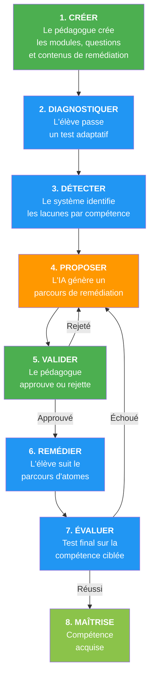
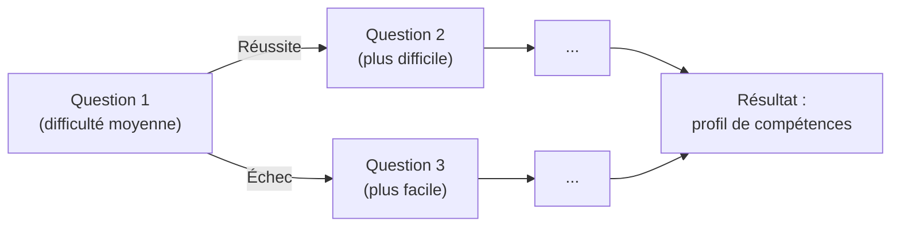
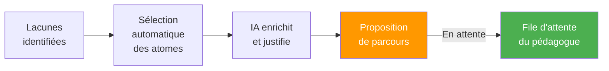
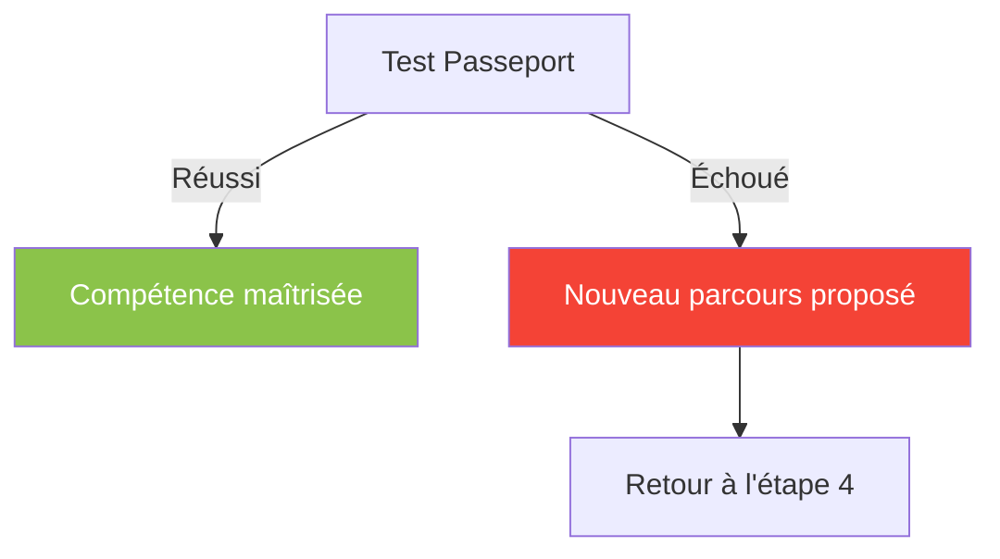
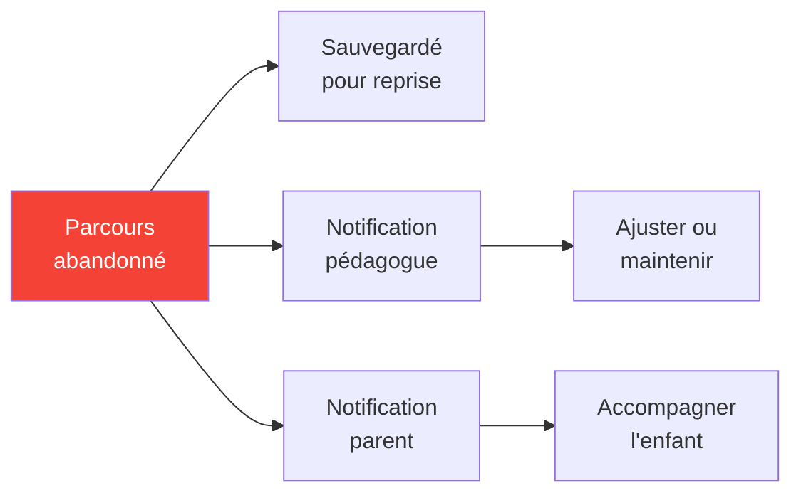
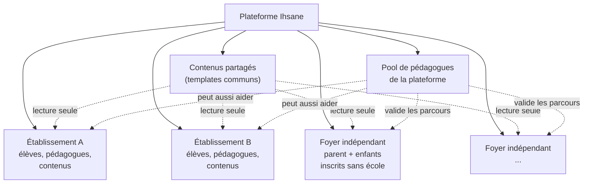
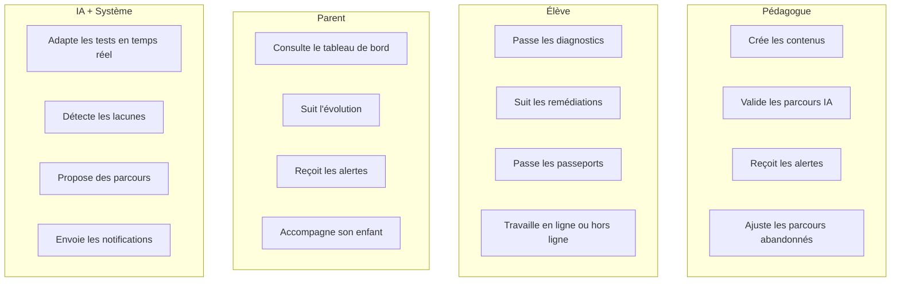

# Ihsane Platform — Comment la plateforme fonctionne

Ce document explique le fonctionnement de la plateforme Ihsane du point de vue **pédagogique** : qui fait quoi, dans quel ordre, et comment le système aide chaque acteur à atteindre son objectif.

---

## Les 3 rôles

| Rôle | Objectif principal |
| --- | --- |
| **Pédagogue (Expert)** | Créer les contenus d'évaluation et de remédiation, valider les parcours proposés par l'IA, suivre les alertes pédagogiques |
| **Élève (Student)** | Passer les évaluations diagnostiques, suivre les parcours de remédiation, valider les compétences |
| **Parent** | Suivre l'évolution de son enfant : résultats, progrès, alertes |

---

## La boucle pédagogique

La plateforme est organisée autour d'une **boucle de 8 étapes**. Chaque fonctionnalité de la plateforme est rattachée à une étape de cette boucle.

**Légende des couleurs :**
- Vert : actions du pédagogue
- Bleu : actions de l'élève / du système
- Orange : action de l'IA

---

## Étape par étape

### Étape 1 — CRÉER (Pédagogue)

Le pédagogue utilise un outil intégré dans la plateforme pour créer :

- **Modules** : une unité pédagogique liée à une matière, un niveau scolaire et une compétence
- **Questions** : les questions du test diagnostique, avec niveau de difficulté et identification de la misconception ciblée
- **Atomes de connaissance** : les contenus de remédiation (audio-visuel, simulation, carte mentale) utilisés pour combler les lacunes

> Le pédagogue est l'auteur de tout le contenu. L'IA ne crée pas de contenu pédagogique à partir de rien — elle sélectionne et organise le contenu que le pédagogue a créé.

---

### Étape 2 — DIAGNOSTIQUER (Élève)

L'élève passe un test adaptatif :

- Le test s'adapte en temps réel : si l'élève réussit, la question suivante est plus difficile ; s'il échoue, elle est plus simple
- Le système utilise un algorithme (Bayesian Knowledge Tracing) pour estimer la probabilité que l'élève maîtrise chaque compétence
- Le test fonctionne **même sans connexion internet** — les réponses sont enregistrées localement et synchronisées plus tard

---

### Étape 3 — DÉTECTER (Système)

Le système analyse les réponses et produit un **profil de compétences** :

| Compétence | Niveau de maîtrise |
| --- | --- |
| Addition de fractions | Maîtrisé |
| Soustraction de fractions | En cours d'acquisition |
| Multiplication de fractions | Non acquis |
| Division de fractions | Non évalué |

Les compétences identifiées comme **non acquises** ou **en cours d'acquisition** sont les lacunes qui nécessitent une remédiation.

---

### Étape 4 — PROPOSER (IA + Système)

L'IA génère un parcours de remédiation personnalisé en deux temps :

1. **Sélection automatique** : le système sélectionne les atomes de connaissance (créés par le pédagogue) qui correspondent aux lacunes identifiées, dans un ordre de difficulté progressif
2. **Enrichissement par IA** : un modèle de langage (IA) ajuste l'ordre, ajoute des justifications pédagogiques, et peut suggérer des contenus supplémentaires

Le résultat est une **proposition** — pas une décision finale. Le parcours ne sera visible par l'élève qu'après validation par le pédagogue.

---

### Étape 5 — VALIDER (Pédagogue)

Le pédagogue reçoit une **notification** quand une proposition est prête. Il peut :

- **Approuver** le parcours → l'élève y accède immédiatement
- **Rejeter** le parcours → l'IA regénère une nouvelle proposition en tenant compte du retour du pédagogue

> Le pédagogue garde toujours le dernier mot. L'IA est un assistant, pas un décideur.

---

### Étape 6 — REMÉDIER (Élève)

L'élève suit le parcours validé :

- Il progresse à travers les **atomes de connaissance** : vidéos, simulations interactives, cartes mentales
- La difficulté s'adapte en fonction de ses performances
- Il peut travailler **hors ligne** — son progrès est sauvegardé localement et synchronisé quand la connexion revient

---

### Étape 7 — ÉVALUER (Système — Test Passeport)

Une fois le parcours terminé, l'élève passe un **test final** (le "Passeport") sur la compétence ciblée :

- **Réussi** → la compétence est marquée comme **maîtrisée** (étape 8)
- **Échoué** → le système retourne à l'étape 4 et propose un **nouveau parcours** de remédiation, avec une approche différente

---

### Le cas de l'abandon

Si un élève abandonne un parcours en cours :

1. Le parcours est **sauvegardé** (pas supprimé) — il pourra être repris
2. Le **pédagogue** est notifié — il peut ajuster le parcours ou le maintenir
3. Le **parent** est notifié — il peut accompagner son enfant

---

## Le tableau de bord parent

Le parent a accès à un tableau de bord qui montre :

| Information | Description |
| --- | --- |
| **Résultats des tests** | Scores des diagnostics et des passeports |
| **Évolution des compétences** | Progression de chaque compétence dans le temps (non acquis → en cours → maîtrisé) |
| **Fermeture des lacunes** | Compétences qui étaient faibles et sont maintenant fortes |
| **Temps et engagement** | Temps passé sur les parcours, régularité du travail |
| **Alertes** | Notifications en cas de difficulté répétée, frustration, ou inactivité |

Le parent reçoit des **notifications en temps réel** (pas besoin de rafraîchir la page) quand un événement important se produit.

> Le parent voit un message simplifié et compréhensible. Le pédagogue voit un message technique plus détaillé pour le même événement.

---

## Les organisations (établissements + familles indépendantes)

La plateforme accueille **deux types d'organisation** :

### Établissements scolaires
- Chaque école a ses propres élèves, parents, pédagogues et contenus
- Les données d'un établissement sont **complètement isolées** des autres
- Un pédagogue peut superviser **plusieurs écoles**
- Un parent peut avoir des enfants dans **différentes écoles**

### Familles indépendantes
- Un parent peut s'inscrire **sans école** — la plateforme crée un "foyer" virtuel
- Le parent crée les comptes de ses enfants et choisit le niveau scolaire
- L'enfant passe les diagnostics et reçoit des remédiations comme dans une école
- **Qui valide les parcours ?** La plateforme dispose d'un **pool de pédagogues de plateforme** qui valident les propositions pour les familles indépendantes

> **Isolation :** Les données personnelles (sessions, réponses, parcours, maîtrise) sont **toujours** limitées à l'organisation. Aucune fuite possible entre établissements ou foyers.

---

## Résumé : qui fait quoi

---

*Ce document est un compagnon de l'Architecture Spine technique. Pour les détails d'implémentation, voir `ARCHITECTURE-SPINE.md`.*
