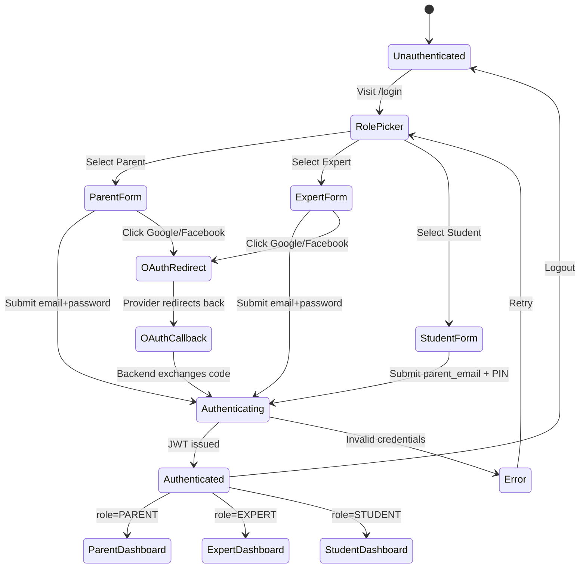
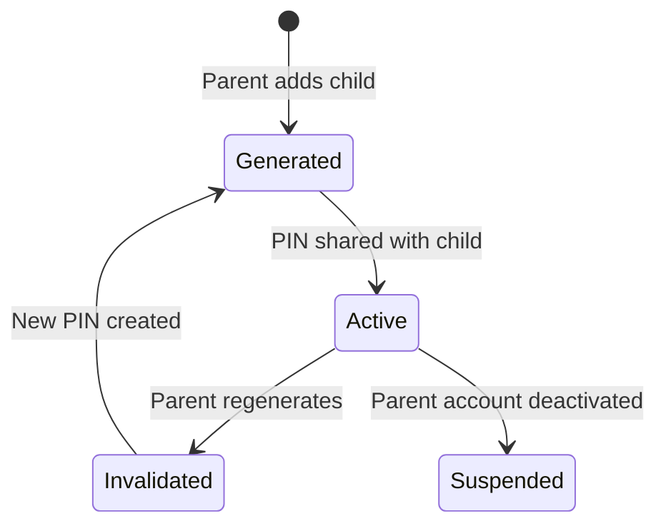

# Data Model: Navigation Restructure & Role-Based User Experience

**Date**: 2026-04-18
**Feature**: 005-navigation-restructure

## Entities

### User (MODIFY existing)

**Source**: [user.py](file:///d:/Developpement/Projets/WEB/smart-da3m/backend/app/models/user.py)

| Field | Type | Nullable | Notes |
|-------|------|----------|-------|
| id | UUID | No | Primary key (existing) |
| email | String(255) | Yes | Unique, indexed (existing) |
| hashed_password | String(255) | Yes | bcrypt hash (existing) |
| pin_code_hash | String(255) | Yes | For students (existing) |
| role | Enum(STUDENT, PARENT, EXPERT) | No | Indexed (existing) |
| language | Enum(AR, FR) | No | Default AR (existing) |
| parent_id | UUID FK→users.id | Yes | Student→Parent link (existing) |
| **display_name** | **String(100)** | **Yes** | **NEW — Full name or pseudo. Populated from registration form or social profile.** |
| created_at | DateTime(tz) | No | (existing) |
| updated_at | DateTime(tz) | No | (existing) |

**Changes**: Add `display_name` column. No existing columns removed.

---

### SocialAccount (NEW)

Links external OAuth providers to internal user accounts.

| Field | Type | Nullable | Constraints | Notes |
|-------|------|----------|-------------|-------|
| id | UUID | No | PK | Auto-generated |
| user_id | UUID FK→users.id | No | Indexed, CASCADE delete | Owner user |
| provider | String(20) | No | `google` or `facebook` | OAuth provider name |
| provider_user_id | String(255) | No | | The user's ID from the provider |
| provider_email | String(255) | Yes | | Email from provider profile |
| access_token | String(512) | Yes | | Encrypted. For API calls if needed |
| created_at | DateTime(tz) | No | | |

**Unique constraint**: `(user_id, provider)` — one account per provider per user.
**Index**: `(provider, provider_user_id)` — fast lookup during OAuth callback.

**Relationships**:
- `User` 1:N `SocialAccount` (a user can link multiple providers)
- Cascade delete: removing a user removes their social accounts

---

### ChildProfile (VIEW — Not a new table)

Child profiles are `User` rows with `role=STUDENT` and a non-null `parent_id`. No separate table needed.

**Derived fields** (queried via joins):
- `display_name` — child's name (from `users.display_name`)
- `grade_level` — **NEEDS NEW FIELD** on User or separate table

> **Note**: The spec mentions grade level for children. The current User model has no `grade_level` field. This should be added as a new nullable column on `User` (only applicable when `role=STUDENT`).

### User (additional field for grade level)

| Field | Type | Nullable | Notes |
|-------|------|----------|-------|
| **grade_level** | **SmallInteger** | **Yes** | **NEW — Student's grade (1–5 for Algerian primary). NULL for non-students.** |

---

## State Transitions

### Authentication Flow

### PIN Lifecycle

## Validation Rules

| Entity | Field | Rule |
|--------|-------|------|
| User | email | Valid email format, unique across all users |
| User | password | Min 8 characters |
| User | pin_code | 4–6 digits only, numeric |
| User | display_name | 2–100 characters, no special characters except spaces and hyphens |
| User | grade_level | 1–5 integer, required when role=STUDENT |
| SocialAccount | provider | Must be `google` or `facebook` |
| SocialAccount | provider_user_id | Non-empty string |
